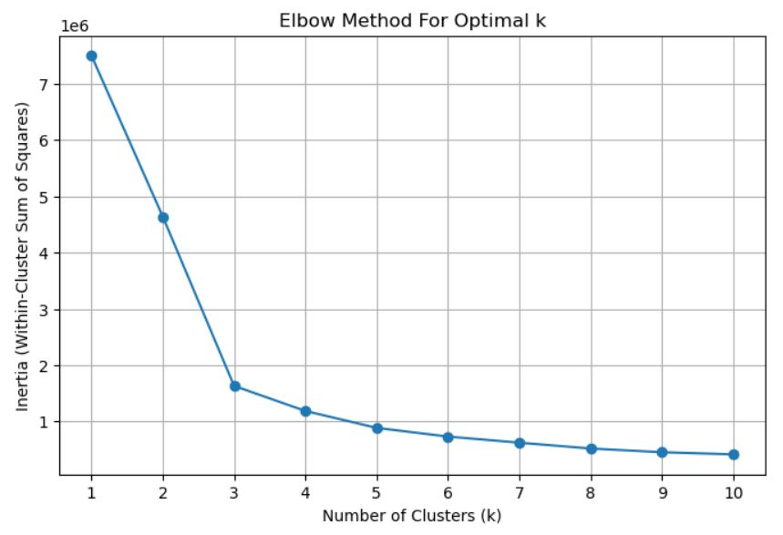

# kmeans-customer-segmentation
This project applies K-Means clustering to an online retail dataset to uncover patterns in customer behavior. The goal is to segment customers into meaningful groups—such as loyal, churned, and newly acquired—and generate business insights that can inform targeted marketing strategies.

## Objectives

Apply K-Means clustering on aggregated customer data

Perform a form of RFM (Recency, Frequency, Monetary) analysis

Identify key customer segments

Recommend tailored business actions based on cluster insights

## Dataset

Source: UCI Machine Learning Repository

Total Records: 541,910

Used Columns: CustomerID, Quantity, InvoiceDate

Missing values were dropped to ensure accurate clustering

### Data Preparation

Converted InvoiceDate to numerical format (days since 1970)

Aggregated data by CustomerID to get:

Quantity_sum

InvoiceDate_min

InvoiceDate_max

InvoiceDate_count

Normalized all numerical features to a 1–100 scale

### Clustering Approach

Implemented K-Means clustering manually for transparency and customization

Used Euclidean distance to assign points to centroids

Recalculated centroids iteratively until convergence

Used the Elbow Method to identify optimal cluster count (k=3)

## Elbow Plot

## Dimensionality Reduction with PCA

Applied Principal Component Analysis to project high-dimensional data into 2D for visualization

First two principal components captured most of the variance

Note: Due to the random initialization in K-Means, cluster sizes and centroids may slightly vary between runs. However, the overall patterns and group behaviors remain consistent.

## Business Recommendations

Cluster 0 (Churned): Launch re-engagement surveys with reward incentives. Identify and address reasons for churn.

Cluster 1 (Loyal): Introduce loyalty rewards and product bundling strategies. Study their habits to guide broader retention policies.

Cluster 2 (New): Offer personalized discounts, referral bonuses, and nurture engagement through targeted campaigns.

## Tools & Libraries

Python

Pandas

scikit-learn

Matplotlib / Seaborn

Jupyter Notebook

